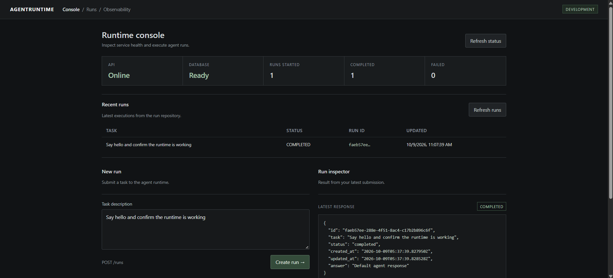
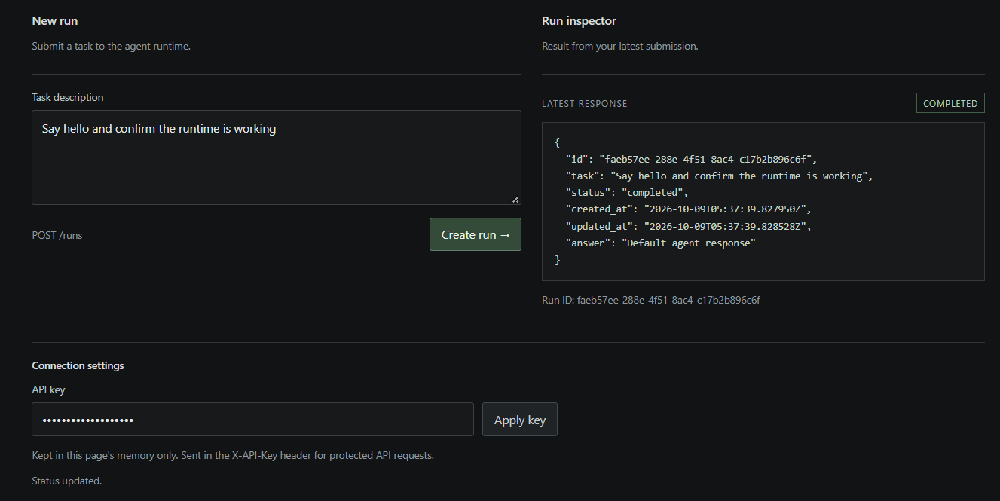

# AgentRuntime

A Python runtime for executing tool-using AI agents.

AgentRuntime is a project to understand and build the infrastructure behind AI agents: tool execution, state management, failure handling, observability, and evaluation. The goal is to keep the execution machinery explicit rather than hide it behind an agent framework.

## Dashboard

The console lets you submit tasks, check service health, and inspect recent runs.





## What it does

The runtime accepts a task, lets an LLM choose its next action, validates tool calls, executes tools, and feeds the results back into the execution loop until the task finishes or fails.

The project includes:

- A FastAPI API for creating, inspecting, and resuming runs
- Typed tool interfaces and argument validation
- File-reading, Python-execution, and SQL tools
- Run state and execution-event tracking
- Retry and failure-handling mechanisms
- API-key authentication for protected endpoints
- Health and database-readiness checks
- Structured logging and runtime metrics
- A browser-based console for submitting tasks and inspecting runs
- PostgreSQL and Alembic migration setup
- Automated tests for API behavior, tool execution, and reliability

## How it works

```text
Task
  |
  v
Agent loop
  |
  v
Select next action
  |
  v
Validate tool call
  |
  v
Execute tool
  |
  v
Record result and update state
  |
  v
Return result to the model
  |
  +---- Continue
  |
  +---- Finish or fail
```

The agent decides what to do next. The runtime is responsible for validating and executing the action, handling the result, and controlling the execution lifecycle.

## Tech stack

- Python
- FastAPI
- Pydantic
- SQLAlchemy and PostgreSQL
- Alembic
- pytest
- Docker Compose
- An LLM API

## Getting started

### Requirements

- Python 3.11 or newer
- Docker Desktop with Docker Compose, or a local PostgreSQL instance for development
- An API key for the configured LLM provider if using a live model

### Local setup

Create and activate a virtual environment:

```bash
python -m venv .venv
```

Windows:

```powershell
.venv\Scripts\activate
```

macOS or Linux:

```bash
source .venv/bin/activate
```

Install the project and development dependencies:

```bash
pip install -e ".[dev]"
```

Run the tests:

```bash
pytest -q
```

Start the API:

```bash
uvicorn app.main:app --reload
```

The exact environment configuration depends on the selected database and model provider. See the project configuration before starting a local instance.

### Docker

Start the services:

```bash
docker compose up --build -d
```

Check service status:

```bash
docker compose ps
```

Check the API health endpoint:

```bash
curl http://localhost:8000/health
```

The Compose configuration currently uses development credentials. Do not expose this configuration directly to the public internet.

## API

The main endpoints include:

| Method | Endpoint | Purpose |
|---|---|---|
| GET | `/health` | Check API health |
| GET | `/ready` | Check database readiness |
| GET | `/docs` | Explore the API through Swagger UI |
| POST | `/runs` | Create and execute a run |
| GET | `/runs` | List recent runs |
| GET | `/runs/{run_id}` | Inspect a run |
| POST | `/runs/{run_id}/resume` | Resume a run |
| GET | `/metrics` | Inspect runtime counters |
| GET | `/dashboard` | Open the browser console |

Protected endpoints require the configured API key in the `X-API-Key` header.

Example request:

```bash
curl -X POST http://localhost:8000/runs \
  -H "Content-Type: application/json" \
  -H "X-API-Key: YOUR_API_KEY" \
  -d "{\"task\":\"Read the project README and summarize it.\"}"
```

Interactive API documentation is available at `/docs` while the server is running.

## Current limitations

This is an ongoing engineering project, not a claim of production readiness.

- Run records and runtime metrics currently use in-memory storage in the default API setup.
- In-memory data can be lost when the API process restarts.
- The development API key must be replaced with a securely managed secret before deployment.
- Production deployment, stronger isolation for Python execution, and load testing require further work.
- PostgreSQL and Alembic are configured, but not all runtime state is persisted to PostgreSQL.

## Testing

The test suite covers the runtime's core behavior, including API requests, tool execution, validation, and failure scenarios.

Run all tests with:

```bash
pytest -q
```

## Design principles

- Keep model reasoning separate from tool execution.
- Validate tool inputs before execution.
- Make execution state explicit.
- Treat failures as part of normal runtime behavior.
- Keep the system testable and observable.
- Add complexity only when the current implementation requires it.

## Project status

AgentRuntime is being developed incrementally, from the project foundation through the execution loop, reliability, observability, evaluation, safety, and deployment.

The emphasis is on understanding the implementation and its trade-offs—not just getting an agent to produce an answer.